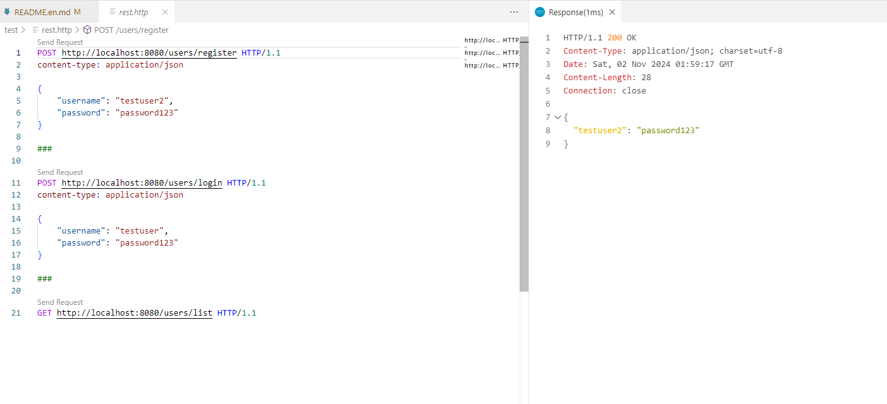

# go-iris-template

#### Description
Template to develop the web application with iris framework.

#### Software Architecture
Just the basic structure of the web application.

#### Installation

1.  go mod tidy
2.  go run main.go

#### Instructions

1.  use the rest-client to test the API
2.  request is below:
```
POST http://localhost:8080/users/login HTTP/1.1
content-type: application/json

{
    "username": "testuser",
    "password": "password123"
}
```

3.  the response will be:
```
HTTP/1.1 200 OK
Content-Type: application/json; charset=utf-8
Date: Sat, 02 Nov 2024 02:03:10 GMT
Content-Length: 28
Connection: close

{
  "testuser2": "password123"
}
``` 

4. the result 



